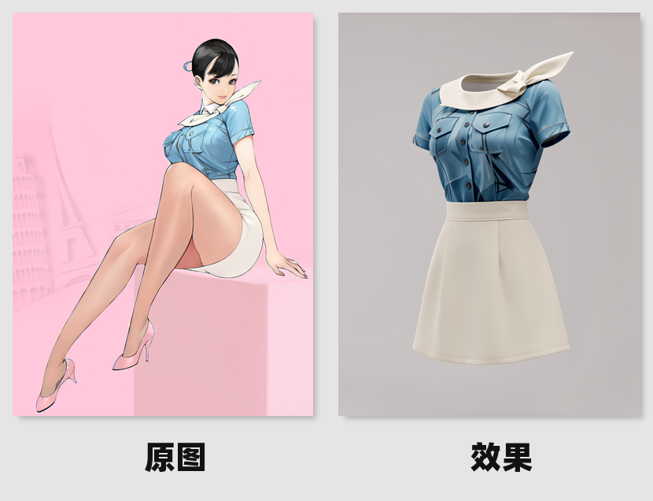
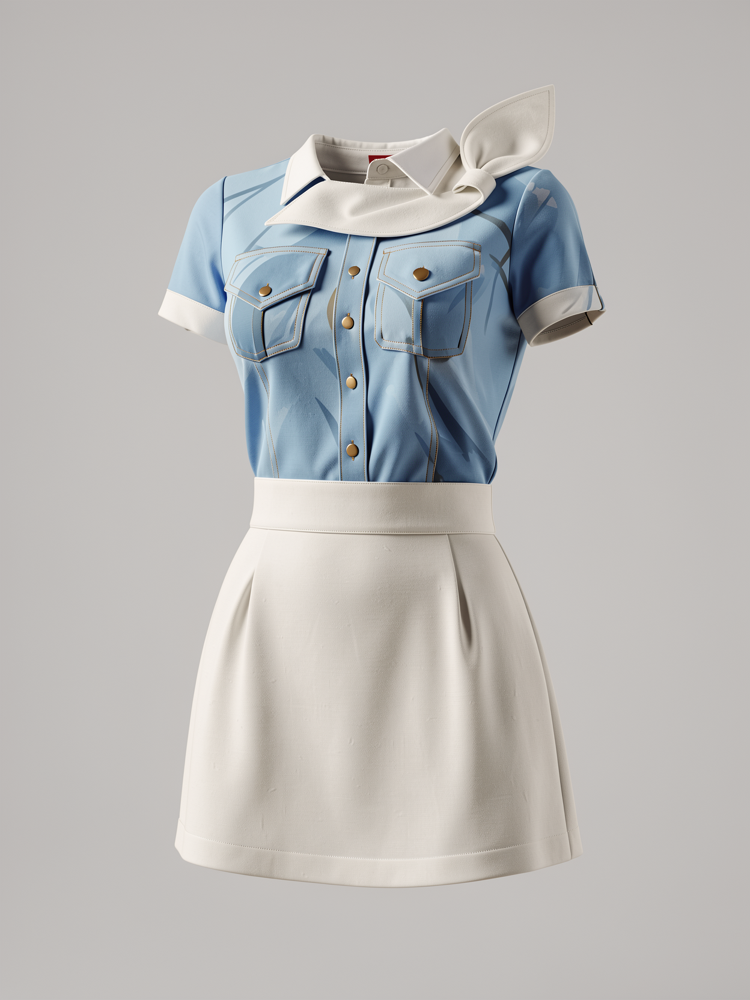
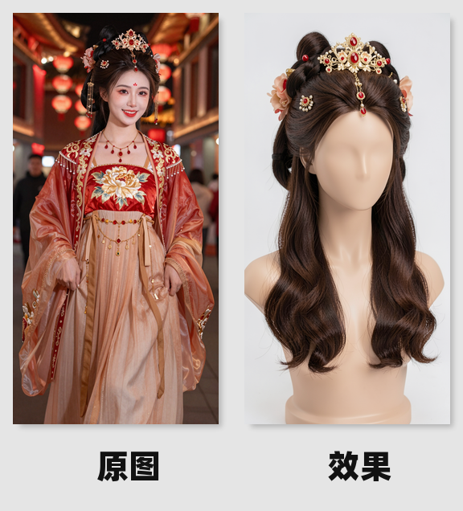

# 广告
## 从图像中提取人物衣服，并以广告形式展示衣服
```
Extract and isolate the clothing worn by the person in the reference image.
Preserve the original garment design, fabric, color, stitching, and details exactly as shown.

Remove the human body completely.
Display the clothing as a high-end fashion advertisement product.

The outfit is presented on an invisible mannequin or floating garment form,
natural structure, realistic folds, accurate proportions.

Clean studio background, soft professional lighting,
luxury fashion brand advertising style,
sharp focus, ultra-detailed fabric texture,
commercial photography, product showcase,
high resolution, editorial fashion ad.
```



## 从图像中提取人物发型
```
Isolate the hairstyle and hair color from the person in the reference image.
Do not change the haircut design or hair color.

Remove the face and replace it with a smooth faceless mannequin head.
The hairstyle remains natural, voluminous, and well-structured.

Luxury hair salon advertisement,
beauty editorial photography,
soft professional salon lighting,
clean minimal background,
cinematic composition.

Ultra-detailed hair strands,
realistic shine and texture,
premium beauty campaign aesthetic,
high resolution.
```


## 黑白照片填色并修复
```
Restore and colorize this old photo. Enhance details and apply natural 1950-x analog colors. Fix any damage and remove artifacts.
```